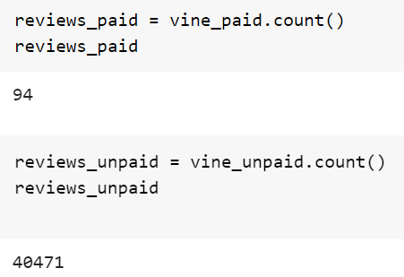
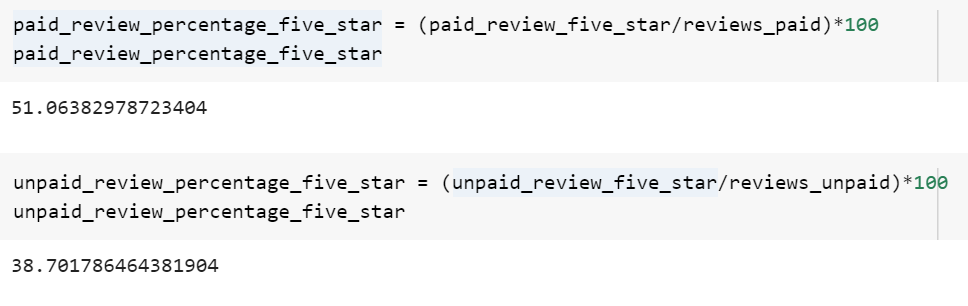

# Amazon_Vine_Analysis

## Overview of the Analysis

The purpose of this analysis was to analyze Amazon reviews written by members of the paid Amazon Vine program. The Amazon Vine program is a service that allows manufacturers and publishers to receive reviews for their products. We selected video games as ou dataset and used PySpark to perform the ETL process to extract the dataset, transform the data, connect to an AWS RDS instance, and load the transformed data into pgAdmin. After we used PySpark to determine if there is any bias toward favorable reviews from Vine members in our dataset.

## Results
 
- From our analysis, there was 94 Vine reviews and 40,471 non-Vine reviews.

 
- There were 48 Vine five star reviews and 15,663 non-Vine five star reviews.

- Approximately 51 percent of Vine reviews were five stars and 39 percent of non-Vine reviews were five stars.

## Summary
From our results, there could be potentially positivity bias for reviews in the Vine program as almost half of them gave five star reviews. However if it were true, it would not matter as the amount of Vine reviews does not compare to the non-Vine reviews. Their vote wouuld not even slightly affect the products overall rating. Additionally, the percentage for five star reviews for both groups are relatively similar with a different of 12 percent. This means that the ratings are probably accurately depicted. An additional analysis to figure it our if there is positive bias would be to compare the rest of the Vine reviews. See how many gave 1 or 3 stars as we are missing half of reviews.
